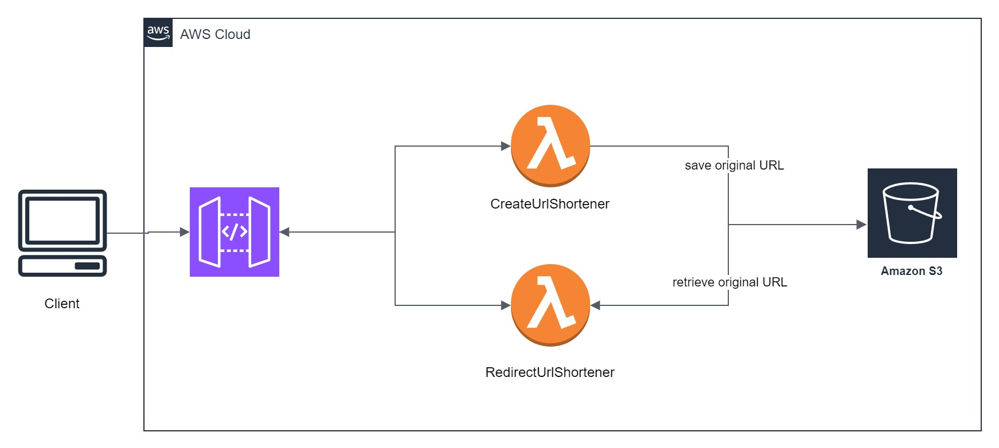

<h1 align="center">Rocketseat - Free Java Course</h1>

## Project

Design for shortening urls and redirecting with Java and AWS.

## Features

- Serverless Architecture;
- Cost Optimization (AWS Well-Architected Framework);

## Architecture

  

## Technologies/Libraries/Environment

- Windows 10 Home | 22H2
- Java 17.0.6
- [IntelliJ IDEA 2024.3 (Community Edition) | 21.0.5+8-b631.13](https://lp.jetbrains.com/intellij-idea-promo/)
- [Insomnia | 10.1.1](https://insomnia.rest/)

## How to run

## License

This project is under the MIT license. See the [LICENSE](LICENSE.md) file for more details.